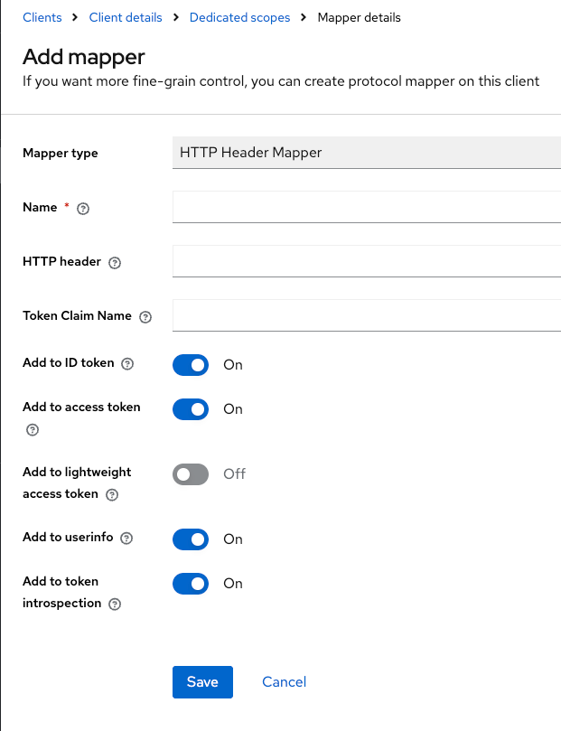

# Keycloak HTTP Header Token Mapper

[https://please-open.it](https://please-open.it)

## Goal

Map an http header given during the authentication process (client_credentials, direct access grant) into a token claim

## Build

```shell
mvn clean install
```

## Usage

On a scope or directly in the client, add a new "HTTP Header Mapper" : 



"HTTP Header" : the header name
"Token claim name" : where to put the value